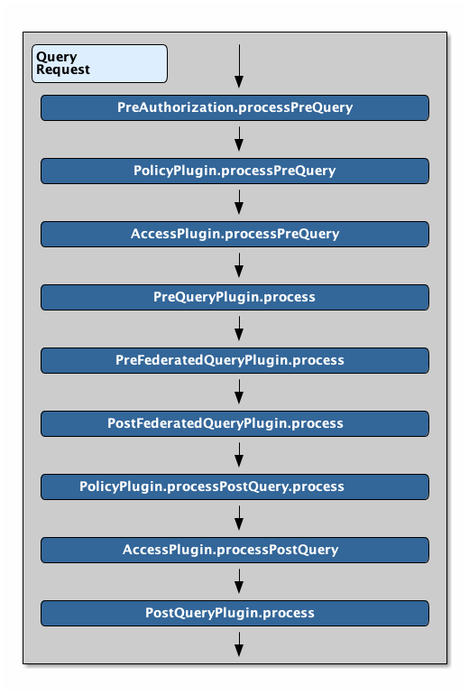
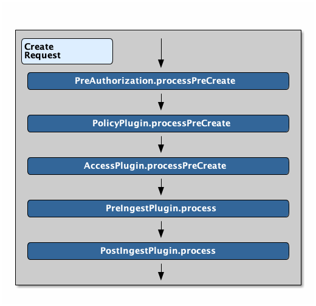
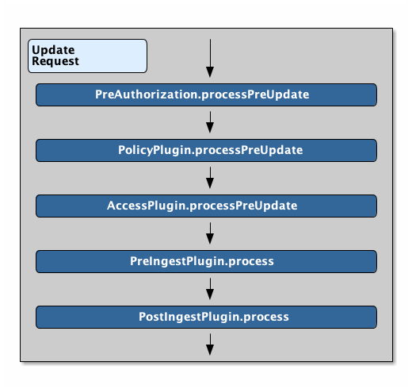
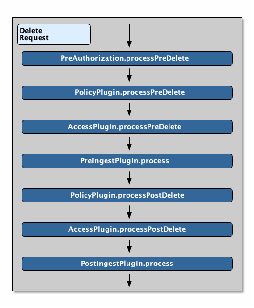
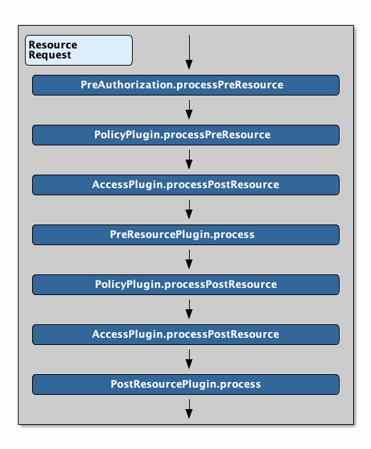
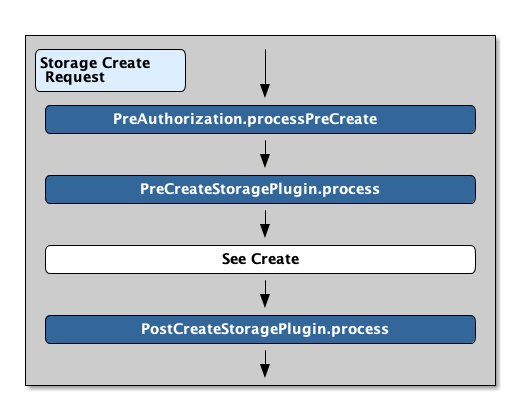
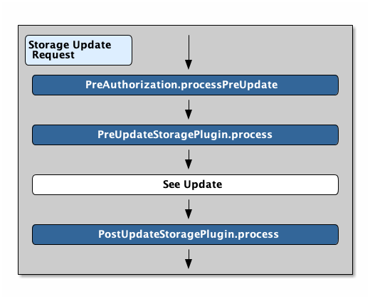

:type: pluginIntro
:status: published
:title: Plugin Invocation
:plugintypes: general
:order: 9999

= Plugin Invocation
Plugins are called in a specific order during different operations. xref:developing:devcomponents/custom-plugins.adoc[Custom Plugins] can be added to the chain for special use cases.

.Query Request Plugin Call Order

.Create Request Plugin Call Order

.Update Request Plugin Call Order

.Delete Request Plugin Call Order

.Resource Request Plugin Call Order

.Storage Create Request Plugin Call Order

.Storage Update Request Plugin Call Order

