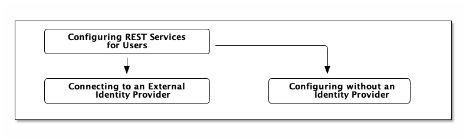

:title: Configuring REST Services for Users
:type: configuration
:status: published
:summary: Configuring REST web service interfaces for user concerns.
:parent: Configuring User Access
:order: 01

= Configuring REST Services for Users

If using REST services or connecting to REST sources, several configuration options are available.

{branding} can be configured to support an xref:managing:configuring/connecting-to-external-idp.adoc[external SAML IdP] or no IdP at all.
The following diagram shows the configuration options.

.REST Services Configuration Options

