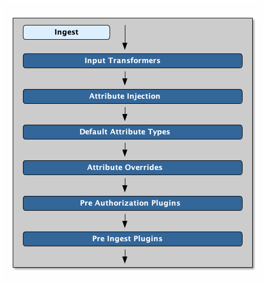

:title: Attributes Added on Ingest
:type: dataManagement
:status: published
:parent: Automatically Added Metacard Attributes
:summary: How attributes are automatically added to metacards during ingest.
:order: 0

= Attributes Added on Ingest

A metacard is first created and populated by parsing the ingested resource with an xref:managing:datamanagement/attributes-added-by-input-transformers.adoc[Input Transformer]. +
Then xref:managing:datamanagement/attributes-added-by-attribute-injection.adoc[Attributes Are Injected], xref:architectures:metacard-groomer.adoc[Default Attribute Types] are applied, and xref:managing:datamanagement/attributes-added-by-attribute-overrides-ingest.adoc[Attribute are Overridden]. +
Finally the metacard is passed through a series of xref:managing:datamanagement/attributes-added-by-pre-authorization-plugins.adoc[Pre-Authorization Plugins] and xref:managing:datamanagement/attributes-added-by-pre-ingest-plugins.adoc[Pre-Ingest Plugins].

.Ingest Attribute Flow

