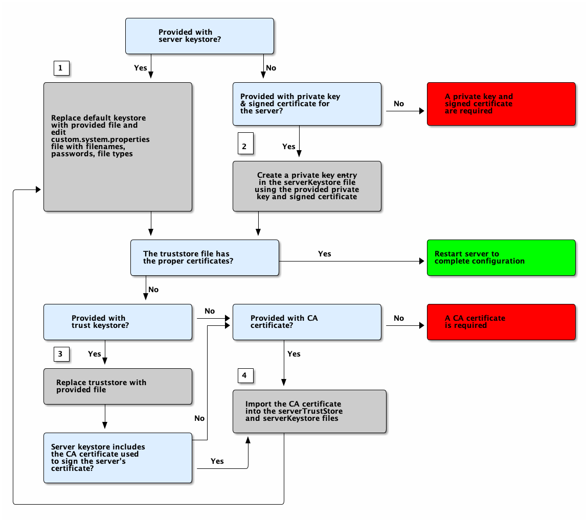

:title: Managing Keystores and Certificates
:type: subInstalling
:status: published
:summary: Keystore and certificate instructions.
:parent: Installing With the {branding} Distribution Zip
:order: 01

= Managing Keystores and Certificates

* *{hardening-step}*

{branding} uses certificates in two ways:

. Ensuring the privacy and integrity of messages sent or received over a network.
. Authenticating an incoming user request.

To ensure proper configuration of keystore, truststore, and certificates, follow the options below according to situation.

.Configuring Certificates Workflow

Jump to the steps referenced in the diagram:

.Certificate Workflow Steps
. xref:managing:installing/managing-keystores.adoc#adding_an_existing_server_keystore[Adding an Existing Keystore]
. xref:managing:installing/managing-keystores.adoc#creating_a_new_keystore_truststore_with_an_existing_certificate_and_private_key[Creating a New Keystore/Truststore with an Existing Certificate and Private Key]
. xref:managing:installing/managing-keystores.adoc#adding_an_existing_server_truststore[Adding an Existing Truststore]
. xref:managing:installing/managing-keystores.adoc#creating_a_server_keystore[Creating a Server Keystore]
.. xref:managing:installing/managing-keystores.adoc#creating_a_server_truststore[Creating a Server Truststore]
